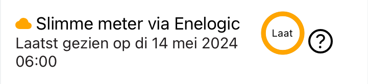

# Slimme meter via Enelogic - FAQ

Veelgevraagde informatie over de woonkamermodule.

## 1. Welke gegevens verzamelt de onderzoeksserver van deze online databron?

[Enelogic](https://enelogic.com/) is een online dienst die u toegang kunt geven om uw slimme meter op afstand uit te lezen. Enelogic is daarvoor gecertificeerd als [Overige Diensten Aanbieder (ODA)](https://nl.wikipedia.org/wiki/Overige_Diensten_Aanbieder). Via de NeedForHeat app kunt u Enelogic toestemming geven aan onze onderzoeksserver om elke dag de volgende meterstanden voor gas en elektriciteit uit uw slimme meter uit te kunnen lezen:

 - intervalstanden tot 10 dagen geleden
    - gas: intervalstanden van elk uur
    - elektriciteit: intervalstanden elke 15 minuten
- dagstanden tot 40 dagen geleden
- maandstanden tot 13 maanden geleden

## 2. Hoe kan ik zien dat de dataverzameling goed loopt?
Kijk in de NeedForHeat-app bij 'Bronnen' onder de sectie 'Slimme meter via Enelogic'. Als dit minder dan 2 dagen (48 uur) geleden is, gaat alles goed. Als je Enelogic net hebt toegevoegd, zie je dat meteen. Wanneer je je slimme meter aan Enelogic hebt gekoppeld, duurt het meestal 1,5 dag voordat Enelogic voor het eerst gegevens ontvangt. Daarna haalt de onderzoeksserver eenmaal per dag nieuwe gegevens op van je Enelogic-account.  

### 2.1. Monitoring in Databronnen
U kunt ook via de Databronnen nagaan of de dataverzameling goed loopt. De cirkel bij Enelogic dient als middel om de uploads van elk apparaat te monitoren. Hieronder volgt een beknopte uitleg van de betekenis van elke cirkel en de bijbehorende acties die u mogelijk moet ondernemen:

#### 2.1.1. Status Groen - Alles is normaal
De DataSource uploadt zoals verwacht zonder problemen, aangegeven door de groene cirkel en pictogram. \
De cirkel toont ook de aftelling naar de volgende upload, met vermelding van uren en minuten.

#### 2.1.2. Status Oranje/Geel - Uploads zijn vertraagd
Als de laatste upload van de DataSource vertraagd is, verandert de cirkel en het pictogram naar oranje/geel, wat wijst op een "Late" status. \
Hoewel dit mogelijk geen onmiddellijke zorg vereist, kunt u proberen de DataSource te resetten om de vertraging te verhelpen.

#### 2.1.3. Status Rood - Ernstige vertraging bij uploads
Wanneer de DataSource gedurende een langere periode geen uploads heeft uitgevoerd, is onmiddellijke actie vereist. \
De rode cirkel geeft een "Offline" status aan. In deze situatie kunt u proberen de DataSource te resetten of contact opnemen met de helpdesk voor assistentie.

## Wat als ik andere vragen of opmerkingen heb?
Stuur dan een e-mail naar de helpdesk van het NeedForHeat-onderzoek via [needforheatonderzoek@windesheim.nl](needforheatonderzoek@windesheim.nl).