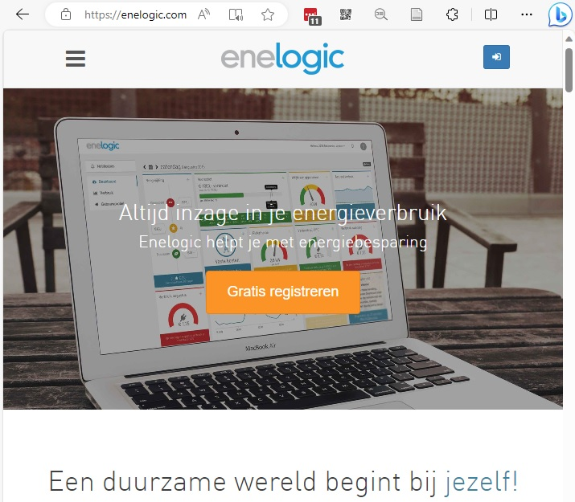

# Smart Meter with Enelogic

# About Enelogic

[Enelogic](https://enelogic.com/) is an online service that allows you to remotely access your smart meter. Enelogic is certified as an [Overige Diensten Aanbieder (ODA)](https://nl.wikipedia.org/wiki/Overige_Diensten_Aanbieder). Through the NeedForHeat app, you can give Enelogic permission to fetch the following meter readings from your smart meter:

- Interval readings up to 10 days ago:
  - Gas: every hour
  - Electricity: every 5 minutes
- Daily readings up to 40 days ago
- Monthly readings up to 13 months ago

# Installation

## 1. Create an Enelogic Account

(If you already have an Enelogic account, you can skip this step.)

Go to [https://account.enelogic.com/register](https://account.enelogic.com/register) and create a free Enelogic account. Remember the email address and password you use for Enelogic. Confirm the code that Enelogic sends to your email address and accept their [privacy policy](https://enelogic.com/nl/privacy) and [terms and conditions](https://enelogic.com/nl/voorwaarden).

## 2. Log in to your Enelogic account and connect your energy meters

Log in to your Enelogic account and connect your energy meters:

1. Click '[Start](https://enelogic.com/nl/web#/gebouw/toevoegen/root.dashboard/root.connect.index)' (found in the blue bar at the top) 
2. Add a building; name it, for example, 'home', enter your postcode and house number, and click 'Toevoegen'.
3. Click 'Koppelen' under 'Slimme meter' on the 'Meter koppelen' screen.
4. Fill out the questions under 'Koppelgegevens.' One of the details you need to fill in is the meter code for your electricity meter (the same code you provided earlier in the questionnaire for the study). Then, grant permission for Enelogic to use your smart meter data.

## 3. Proceed in the NeedForHeat app to connect with Enelogic

After following the steps above, you can proceed to connect with Enelogic in the NeedForHeat app.