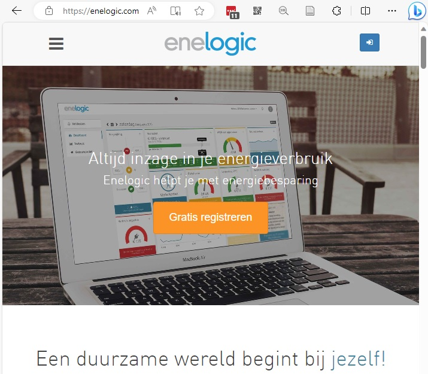

# Slimme meter met Enelogic

# Over Enelogic

[Enelogic](https://enelogic.com/) is een website waarmee u uw slimme meter op afstand kunt bekijken. Het is goedgekeurd als [Overige Diensten Aanbieder (ODA)](https://nl.wikipedia.org/wiki/Overige_Diensten_Aanbieder). Via de NeedForHeat app kunt u Enelogic toestemming geven om de volgende meterstanden van uw slimme meter op te halen:

- Intervalstanden tot 10 dagen geleden:
  - Gas: elk uur
  - Elektriciteit: elke 15 minuten
- Dagstanden tot 40 dagen geleden
- Maandstanden tot 13 maanden geleden

# Installatie

## 1. Maak een Enelogic account

(Als u al een Enelogic account heeft, kunt u deze stap overslaan.)

Ga naar [https://account.enelogic.com/register](https://account.enelogic.com/register) en maak een gratis Enelogic account aan. Onthoud het e-mailadres en wachtwoord dat u bij Enelogic gebruikt. Bevestig de code die Enelogic naar uw e-mailadres stuurt en accepteer hun [privacybeleid](https://enelogic.com/nl/privacy) en [algemene voorwaarden](https://enelogic.com/nl/voorwaarden).

## 2. Log in op uw Enelogic account en koppel uw energiemeters

Log in op uw Enelogic account en koppel uw energiemeters:

1. Klik op '[Start](https://enelogic.com/nl/web#/gebouw/toevoegen/root.dashboard/root.connect.index)' (te vinden in de blauwe balk bovenaan het scherm) 
2. Voeg een gebouw toe; noem het bijvoorbeeld 'thuis', vul uw postcode en huisnummer in en klik op 'Toevoegen'
3. Klik in het scherm 'Meter koppelen' onder 'Slimme meter' op 'Koppelen'
4. Vul de vragen onder 'Koppelgegevens' in. Een van de gegevens die u moet invullen is de metercode van uw elektrameter (dezelfde code die u eerder heeft ingevuld bij de vragenlijst voor het onderzoek). Sta vervolgens toe dat Enelogic de gegevens van uw slimme meter mag gebruiken.

## 3. Ga verder in de NeedForHeat app om met Enelogic te verbinden

Nadat u de bovenstaande stappen hebt gevolgd, kunt u doorgaan met het verbinden van Enelogic in de NeedForHeat app.

